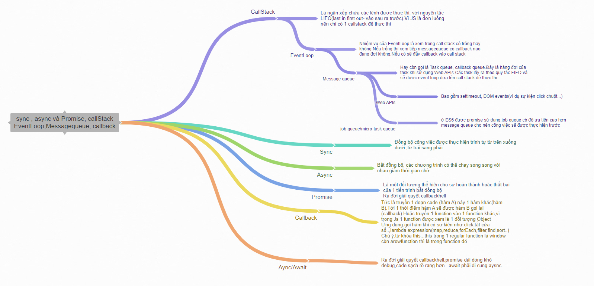

# Exercise-01-ReactJS

## 1. Break The UI Into A Component Hierarchy

<image src="./image/Break.png"></image>

### Các thành phần

1. Container (màu đỏ): Là phần chứa toàn bộ trang web
2. Header (màu cam) : Chứa logo, Input địa chỉ giao hàng, button đăng nhập, button giao hàng
3. Body ( màu xanh trời đậm): Là phần content của trang web
    1. Left Container (màu tím): Chứa danh sách catergory
        1. Catergory List (màu đỏ): Chứa các danh mục catergory
    2. Product Container ( màu xanh lá đậm):
        1. ProductList (màu tím): Chứa các Product Item
    3. Cart Container(màu đà): Chứa thông tin order,coupon
4. Footer (màu vàng) : Là phần chân của trang web hiển thị thông tin giới thiệu, hỗ trợ
## Thành phần chung tái sử dụng

1. Button (màu xanh lá cây): Là thành phần nút bấm
2. SearchInput(màu xanh ngọc): Là thành phần nhập dữ liệu người dùng
3. Currency (màu đen): Là thành phần hiển thị giá tiền
4. Image Product (màu vàng đậm): Chứa ảnh 
5. ButtonAdd(màu lam ) : Dùng để thêm sản phẩm vào giỏ hàng 
6. Product Item (màu xanh trời tím nhạt ): Chứa thông tin sản phẩm 

### Mô hình cấp bậc
- Container
    - Header
        - Button
        - Search Input
        - Button
    - Body
        - Left Container
            - Product List 
                - Product Item
        - Product Container
            - Search Input 
            - Product List
                - Product Item
                    - Image
                    - Currency
                    - Button Add
        - Cart Container
            - Button
            - Currency
            - Search Input
            - Currency
    - Footer


    
## 2. Xây dựng một bản tĩnh
- Hiển thị danh sách Category bằng cách fetch API lấy dữ liệu về
- Hiển thị danh sách sản phẩm theo nhóm Category :
  - Gộp 2 API lại để hiển thị ra được sản phẩm theo nhóm

## 3: Trạng thái của người dùng
- Thanh Search sẽ là trạng thái 
- Thanh Category sẽ là trạng thái


# Bài tập 4
## COMPONENT ORDER

<image src="./image/order.png"></image>

### Các thành phần 

1. Container màu vàng chứa toàn bộ nội dung của 1 phiếu order product
2. Header màu cam chứa hình ảnh và tên và size sản phẩm
    1. Image màu đỏ chứa image sản phẩm
    2. Name Product màu tím chứa tên sản phẩm
    3. Size màu xanh trời chưa size
3. Body màu tím đậm dùng để chứa loại size
    1. Loại size màu xanh trời 
4. Footer màu hồng chứa ghi chú, số lượng sản phẩm và nút thêm vào giỏ hàng
    1. Input màu xanh lá thêm ghi chú
    2. Nút xanh trời nhạt cộng trừ số lượng sản phẩm 
    3. Số lượng hình tròn màu tím
    4. Nút màu xanh lá thêm vào giỏ hàng khi order xong
    5. Tổng giá tiền màu tím
5. Nút close màu đen tắt order

### Mô hình cấp bậc

- Container 
    - Header
        - Image
        - Name Product
        - Size Product
    - Body
        - Size Product
    - Footer
        - Input Note
        - Button Trừ
        - Button Cộng
        - Số lượng
        - Button 
            - Text
            - Price Sum
    - Close
## COMPONENT GIAO HÀNG
<image src="./image/giaohang.png"></image>

### Các thành phần 

1. Container màu đỏ chứa toàn bộ nội dung phần chọn thời gian giao hàng
2. Button giao hàng,thời gian đặt hàng màu xanh dương 
3. Body màu xanh trời nhạt chứa nội dung thời gian ngày và giờ đặt hàng
4. Button hẹn giờ màu xanh lá  
5. Option ngày đặt màu vàng chứa ngày đặt 
6. Option giờ đặt hàng màu vàng chứa ngày đặt
7. Tiêu đề ngày đặt, thời gian màu tím

### Mô hình cấp bậc
- Container 
    - Button Giao Ngay
    - Button Thời Gian Đặt Hàng
        - Body 
            - Title Ngày Đặt 
            - Option Chọn ngày
            - Title Thời Gian Đặt
            - Option Chọn giờ
            - Button hẹn giờ 
## ASYNC, SYNC, PROMISE




### NOTE


- Chú thích update code 2 tuần vừa qua.

17.18- Code ShipNow 
- Ở component Header
	- Tạo ra các state
		- `openDropDownTime` dùng để giữ trạng thái hiển thị hoặc k hiển thị của `component ShipNow`
		- `textBtnShipNow` : dùng để lưu nội dung "Ngày và giờ giao hàng"
		- `timeNow`: dùng để lưu thời gian hiện tại
		- `dateNow`: dùng để lưu ngày/tháng/năm hiện tại
		- `dataDate`: dùng để lưu dữ liệu ngày/tháng/năm hiện tại và 2 ngày tiếp theo
		- `dateTime`: dùng để lưu dữ liệu thời gian hiện tại cho đến thời gian đóng cửa
		- `dateTimeDefault`: dùng để lưu dữ liệu thời gian mặc định từ 7h30 đến 20h30
		- `this.container=react.createRef()` : dùng để bắt sự kiện 
    	- `this.findAddress = React.createRef()`: dùng để bắt sự kiện `onChange` 
		
	- Các hàm : 

		- `handleChangeAddress`: `debounce`, khi `onChange` input `searchAddress` thì khi `onChange` sau 0.4s nó mới gọi API chứ k phải nhập 1 kí tự là gọi API 1 lần

		- `handleOpenDropDown`: dùng để xác định trạng thái mở hay đóng của 

        - `openDropDownTime` khi Click vào button giao Ngay
		- `handleClickOutside` : dùng để bắt sự kiện khi `mousedown` thì nó sẽ set lại trạng thái của `openDropDownTime` đóng lại
		- `pushDataDate`: dùng để set dữ liệu `dataDate` [Bao gồm ngày hiện tại, và 2 ngày tiếp theo]
		- `pushDataTime`: dùng để set dữ liệu `dateTime` 
			- `setTimeStart`: Bằng giờ hiện tại, phút hiện tại cộng thêm + 60 - phút hiện tại 
			- `setTimeEnd` : bằng 20:30
			- Dùng vòng for chạy từ `timeStart` đến khi `timeStart` bé hơn hoặc bằng `timeEnd` và rồi phút `setTimeStart` + thêm 15
			- Rồi push `timeStart` vào một mảng sau đó set state `dataTime` bằng mảng đó
		- `setDateTimeDefault`: tương tự như `pushDataTime`
		- `setTextBtnShipNow`: dùng để nhận lại `date`,`time` từ `ShipNow` truyền qua
			- Nếu `time` === `timeNow` và `date` === `dateNow` set state `textBtnShipNow` bằng text GIAO NGAY
			- Ngược lại set state `textBtnShipNow` bằng `date`,`time` từ `ShipNow` trả về
		- `setOpenDropDownTime` : dùng để bắt sự kiện `Click` khi mà click vào nút Giao Ngay thì set trạng thái `openDropDownTime` tắt đi và `textBtnShipNow` bằng text GIAO NGAY

		- `componentDidMount` : 
			- Gọi hàm `setDateTimeDefault()` cho chạy lần đầu tiên 
			- Gọi hàm `pushDataDate()` chạy lần đầu tiên
			- Bắt sự kiện `mousedown` gọi tới `handleClickOutside` để set trạng thái cho `openDropDownTime`
			- Set dữ liệu cho `timeNow`, `dateNow`
		- `componentWillUnmount`: 
			- `remove` sự kiện `mousedown` 

		- `return`: 
			- Truyền `props` cho `ShipNow`
            ```jsx
            	 <ShipNow
                    setTextBtnShipNow={this.setTextBtnShipNow}
                    textBtnShipNow={this.state.textBtnShipNow}
                    dateNow={this.state.dateNow}
                    timeNow={this.state.timeNow}
                    dataDate={this.state.dataDate}
                    dataTime={this.state.dataTime}
                    pushDataTime={this.pushDataTime}
                    dateTimeDefault={this.state.dateTimeDefault}
                    setOpenDropDownTime={this.setOpenDropDownTime}
                  />
            ```
- Tạo `Component ShipNow`
	- Code tĩnh 
	- Đẩy dữ liệu từ `header` qua
		- Tạo các state 
			- `open` : dùng để giữ trạng thái hiển thị hoặc đóng của phần thời gian đặt hàng
			- `dateSelect`: dùng để giữ giá trị ngày khi select option ngày
			- `active`: dùng để giữ trạng thái active cho 2 nút GIAO NGAY, THỜI GIAN ĐẶT HÀNG
		- Các hàm
			- `handleTimerOrder`: gọi hàm `pushDataTime`, setState `open` thành true để hiển `DropDown` THỜI GIAN ĐẶT HÀNG
			- `clickTimer`: dùng để lấy giá trị date và time khi click nút HẸN GIỜ NGAY
				- Gọi tới hàm `setTextBtnShipNow` truyền vào giá trị `date` và `time` đã được lấy từ 2 select `date` và `time` 
				- Nếu như `date` và `time` ở 2 select bằng với `dateNow` và `timeNow `set `open` thành `false` đóng `DROPDOWN` THỜI GIAN ĐẶT HÀNG LẠI
				- Set `active` bằng `true` để `active` vào phần GIAO NGAY
			`getSelect`: dùng để lấy giá trị date khi `onChange` select `date` và set state  `dateSelect`
			`getShipNow`: dùng để gọi đến hàm `setOpenDropDownTime`


 ### 21-24/6-2021 Coder Add To Cart 
 - Ở `component App`
	- Các `state` 
		`totalAmount`: lưu tổng số sản phẩm add vào `Cart`
	- Các hàm 
		`setTotalAmount` : dùng để set state `totalAmount` lại
	- Ở render 
		- Tạo  `props totalAmount` truyền `state totalAmount` qua cho header
		- Tạo props truyền hàm `setTotalAmount` qua cho `Body`

- Ở component Header 
	 - Ở render 
	 	- Hiển thị tổng số sản phẩm được Add vào giỏ hàng

- Ở `component Body` 
	- Ở constructor
		- `Ref container` : để bắt sự kiện click của người dùng
		-  State new: 
			- `dataItem`: lưu dữ liệu của từng sản phẩm
			- `layoutOrder`: lưu trạng thái bật tắt layout đặt hàng		
			- `listOrder`: chứa sản phẩm người dùng đặt hàng
			- `sizeActive`: lưu size người dùng chọn tương ứng với 1 sản phẩm
			- `price_new`: lưu tổng giá tiền của 1 lần đặt của 1 sản phẩm
			- `toppingActive`: lưu topping người dùng chọn tương ứng với 1 sản phẩm
			- `amount`: lưu số lượng sản phẩm được chọn của 1 sản phẩm
			- `txtNote`: lưu ghi chú của người dùng của 1 sản phẩm
			- `indexEdit`: 
			- `totalAmount`:lưu tổng số lượng sản phẩm người dùng đặt
			- `totalPrice`: lưu tổng số tiền sản phẩm trong giỏ hàng

	- Các hàm 
		- `getDataItem`: dùng để lấy dữ liệu của 1 sẩn phẩm từ `component ProductList`, set lại state giá trị mặc định của sản phẩm
		- `getSize`: dùng để set state `sizeActive` và `price_new` 
		- `getCheck`: dùng để set state `toppingActive` và `price_new`
		- `plusAmount`: dùng để tăng state `amount` lên 1 
		- `minusAmount`: dùng để giảm state `amount` lên 1 
		- `setTxtNote`: set lại state cho `txtNote` (ghi chú )
		- `addToCart`: add sản phẩm vào `listOrder` ( giỏ hàng),set state lai `outOrder`, `indexEdit`, đẩy dữ liệu lên  `localStorage`
		- `getTotalAmount`: set state `totalAmount`, `totalPrice`
		- `editDataProduct`: 	
            ```jsx
                set lại state 
                dataItem: item,
                layoutOrder: true,
                sizeActive: item.sizeActive,
                price_new: item.price_new / item.amount,
                toppingActive: item.toppingActive,
                amount: item.amount,
                txtNote: item.txtNote,
                indexEdit: index,
            ```
		- `addToCartV2`: tạo ra 1 `objCart` chứa các key và value mới của 1 sản phẩm đẩy `key` và `value` đó vào object của 1 sản phẩm,set state lại cho `txtNote`
 
        
	- Ở render
		- Component `CartContainer` : Tạo các props  
        ```jsx
            listOrder={this.state.listOrder}
            editDataProduct={this.editDataProduct}
            totalAmount={this.state.totalAmount}
            totalPrice={this.state.totalPrice}
        ```
		- Component `Order`:  
			- `src`=`{this.state.dataItem.image}` : link ảnh của sản phẩm
            - `product_name`=`{this.state.dataItem.product_name}` : tên của sản phẩm
            - `onClick`=`{() => this.setState({ layoutOrder: false, indexEdit: -1 })}`
			- Khi mà `onClick` vào dấu nhân thì `layoutOrder` đóng lại , set State
             ```jsx
                indexEdit -1
                dataItem={this.state.dataItem}
                addToCartV2={this.addToCartV2}
                getSize={this.getSize}
                getCheck={this.getCheck}
                plusAmount={this.plusAmount}
                minusAmount={this.minusAmount}
                setTxtNote={this.setTxtNote}
                txtNote={this.state.txtNote}
                sizeActive={this.state.sizeActive}
                price_new={this.state.price_new}
                toppingActive={this.state.toppingActive}
                amount={this.state.amount}
            ```
- Ở component `Order`
	- Các hàm:
		- `componentDidMount` : kiểm tra props `sizeActive` === `null` thì 
		gọi hàm get size truyền vào id của element input[checked] và `price_new`
		- `onChangeInput`: gọi props `setTxtNote` truyền ghi chú thêm vào 
	- Các props: 
        ```jsx
                dataItem,
                addToCartV2,
                getSize,
                getCheck,
                plusAmount,
                minusAmount,
                sizeActive,
                price_new,
                toppingActive,
                amount,
                txtNote,
                onClick,
                src,
                product_name,
        ```
	- render
		- `product_name`
		- `size` : map variants để so sánh code của sản phẩm bằng với props `sizeActive` không thì in ra size của sản phẩm
		- `topping` : map `topping_list` của sản phẩm dùng `includes` kiểm tra props `toppingActive` có nằm trùng code `topping_list` không
		nếu trùng thì in tên `topping` 
		và dấu cộng nếu chỉ số bé hơn `toppingActive` -1 

		- Icon `close` gọi props `onClick` để đóng `layoutOrder`

		- Check `size`: `map` `variants` 
			`defaultChecked` kiểm tra `sizeActive` trùng `code` thì `checked`, ngược lại mặc định là `checked` element có `index`===`0`
			`onClick`: gọi tới props `getSize` nhận vào `code`, `price` để `set` lại `size` và giá tiền cho sản phẩm đang `order`

		- Check `Topping` : map `topping_list` 
			- `defaultChecked`: dùng `includes` kiểm tra `toppingActive` nằm trong `topping_list` thì `checked`
			- `onClick` : gọi tới hàm `getCheck` 
				+ `getCheck` : tạo ra 1 biến `coppyTopping` coppy state `toppingActive` dùng `includes` kiểm tra code `Topping` của sản phẩm đó trùng với `toppingActive` 
				nếu trùng thì `set` lại biến `coppyTopping` sẽ là giá trị trả về khi `filter` `toppingActive` nếu `code` `toppingActive` === `code` của `topping_list` thì trả về `true` và thực hiện việc `setState` cho `toppingActive` = `coppyTopping`,`price_new` = `price_new` hiện tại `-` `price` của `topping` đó nếu không trùng thì `push` `code` vào biến `coppyTopping`và `set` lại state `toppingActive`=`coppyTopping` `price_new` = `price_new` hiện tại `+` `price` của `topping` đó
		- Search `input`: `value` nhận dữ liệu `txtNote`
			`handleChange`: gọi hàm `onChangeInput` để set lại state `txtNote` khi người dùng `Click` vào sản phẩm ở giỏ hàng để chỉnh sửa
		- Btn `plus`: `onClick` gọi tới hàm `plusAmount`
		- Btn `minus` : `onClick` gọi tới hàm `minusAmount`
		- Btn đặt hàng: 
			- `onClick` gọi hàm `addToCartV2`
				- Hàm `addToCartV2`: 
					-Tạo 1 biến `txtNote` lưu giá trị ghi chú thêm
					- Set state `txtNote` = biến `txtNote`
					- Tạo 1 `objCart` 
						+ `coppy` dữ liệu của `item` đó và tạo thêm các key 
                          ```jsx
                                price_new: lưu tổng giá
                                amount: lưu số lượng
                                toppingActive: lưu topping được chọn
                                txtNote: lưu ghi chú thêm
                                sizeActive: lưu size được chọn
                          ```
					- Gọi hàm `addToCart` truyền `objCart` vào
						- Hàm `addToCart`:
							+ Tạo 1 biến `flag=1` dùng để check có add thêm vào hay chỉ cộng số lượng lên 
							+ Tạo 1 biến `arrEdit` = `coppy` state `listOrder`
							+ Kiểm tra `indexEdit` mà khác `-1` nghĩa là :
								- Khi `click` vào sản phẩm ở phần giỏ hàng thì nó `set` lại `indexEdit` bằng với `index` hiện tại của sản phẩm đó 
								sau đó dùng `filter` lọc ra 1 mảng gán cho mảng `arrEdit` nếu index hiện tại của các sản phẩn trong `arrEdit`
								khác với `index` của sản phẩm thì trả về `true` giữ lại trong `arrEdit` còn nếu giống thì trả về `false` 
								và loại sản phẩm đó ra khỏi mảng
							+ map `arrEdit` kiểm tra 
							    `item._id === data._id` &&
								`item.sizeActive === data.sizeActive` &&
								`JSON.stringify(item.toppingActive)` ===
								`JSON.stringify(data.toppingActive)` &&
								`item.txtNote === data.txtNote`
								thì `amount` sẽ bằng `amount` hiện tại cộng thêm `amount` của sản phẩm mới thêm vào
								`price_new` tương tự
								và gán biến `flag` bằng `flag*=-1 => 1*-1=-1`
								`flag=-1` thì không chạy `if` tiếp theo 
								`flag= 1` thì chạy câu `if` tiếp theo set lại state `listOrder`: [`coppy` `arrEdit`, sản phẩm mới thêm vào] dùng `filter` để lọc số lượng phải `amount > 0` nếu `< 0` or `=0` trả về `flase` thì sẽ bị loại ra khỏi `listOrder` gọi hàm `getTotalAmount` để tính tổng số lượng đẩy lên `localStorage`
								`flag=-1` thì chạy `else` set state `listOrder`= [coppy `arrEdit`] gọi hàm `getTotalAmount` để tính tổng số lượng đẩy lên `localStorage`
							+ set State `indexEdit=-1`,
							 tắt ` layoutOrder`


- Component `CartContainer`
	- Các hàm : 
		`getDataCart` lấy dữ liệu của sản phẩm trong giỏ hàng lấy `item` và `index` truyền qua cho props `editDataProduct`
	- Props 
		- `editDataProduct`: 
            - Hàm `editDataProduct` set lại state 
            ```jsx
                dataItem: item,
                sizeActive: item.sizeActive,
                price_new: item.price_new / item.amount,
                toppingActive: item.toppingActive,
                amount: item.amount,
                txtNote: item.txtNote,
                indexEdit: index,
                layoutOrder: true,
            ```
            - `totalPrice`: tổng giá tiền
            - `totalAmount`: tổng số lượng món 

	- Render
		- map `listOrder` ra hiển thị 

### REPORT
- Làm thêm được 
    - Chia component thời gian giao hàng (shipnow)
    - Chia component order (order)
	- Phần thời gian giao hàng
	- Xử lý lại API map
	- Xử lý sự kiện với Ref của react
	- Phần order của khách hàng
	- Phần giỏ hàng của khách hàng

- Học thêm được 
	- React hook
		useState()
		useEffect()
	- Xử lý dữ liệu với time 
	- Sử dụng được Ref trong react
	- Áp dụng được debounce khi onChange
	- Sử dụng localStorage để lưu dữ liệu order người dùng lên Browser
- Khó khăn 
	- Khi làm phần thời gian giao hàng
		+ Khó khăn khi xử lý giờ [nhưng đã tìm hiểu và xử lý được]
	- Khi làm giỏ hàng: 
		+ Khó ở chỗ xử lý khi add thêm vào giỏ hàng và từ giỏ hàng chọn sản phẩm để chỉnh sửa.
		[Nhưng đã tìm tòi và tạm xử lý được, mà không biết xử lý như vậy có được không.]
		+ Chưa tối ưu được code 
		
	


